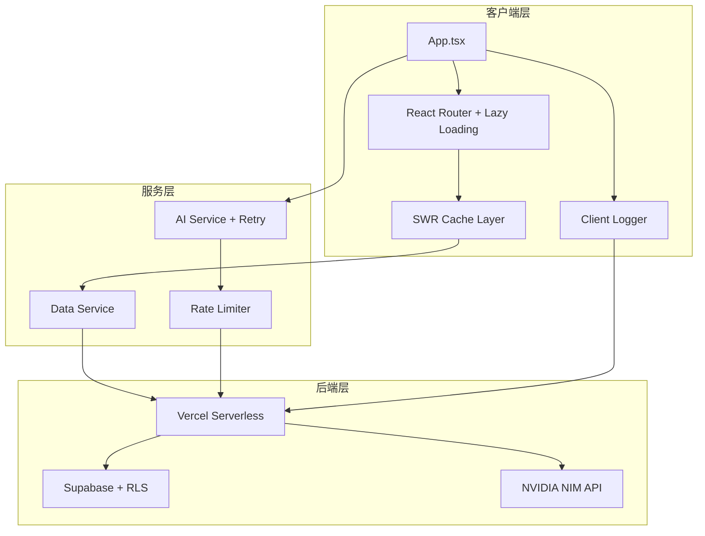

# Design Document: Industrial Grade Optimization

## Overview

本设计文档描述将 Aura 博客升级为工业级 Web 应用的技术方案。采用渐进式优化策略，确保每个改动都可独立验证和回滚。

## Architecture



## Components and Interfaces

### 1. 路由懒加载模块

```typescript
// routes/index.tsx
import { lazy, Suspense } from 'react';
import { RouteObject } from 'react-router-dom';
import LoadingFallback from '@/components/LoadingFallback';

const Feed = lazy(() => import('@/pages/Feed'));
const PostDetail = lazy(() => import('@/pages/PostDetail'));
const Notes = lazy(() => import('@/pages/Notes'));
const NoteDetail = lazy(() => import('@/pages/NoteDetail'));
const About = lazy(() => import('@/pages/About'));
const Archive = lazy(() => import('@/pages/Archive'));

export const routes: RouteObject[] = [
  { path: '/', element: <Feed /> },
  { path: '/post/:slug', element: <PostDetail /> },
  { path: '/notes', element: <Notes /> },
  { path: '/note/:id', element: <NoteDetail /> },
  { path: '/archive', element: <Archive /> },
  { path: '/about', element: <About /> },
];

export const LazyRoute: React.FC<{ children: React.ReactNode }> = ({ children }) => (
  <Suspense fallback={<LoadingFallback />}>
    {children}
  </Suspense>
);
```

### 2. Vite 分包配置

```typescript
// vite.config.ts - build optimization
export default defineConfig({
  build: {
    rollupOptions: {
      output: {
        manualChunks: {
          'vendor-react': ['react', 'react-dom', 'react-router-dom'],
          'vendor-motion': ['framer-motion'],
          'vendor-supabase': ['@supabase/supabase-js'],
        },
      },
    },
    cssCodeSplit: true,
    chunkSizeWarningLimit: 500,
  },
});
```

### 3. 数据缓存服务

```typescript
// services/cacheService.ts
import useSWR, { SWRConfiguration } from 'swr';

interface CacheConfig extends SWRConfiguration {
  ttl?: number;
}

const defaultConfig: CacheConfig = {
  revalidateOnFocus: false,
  revalidateOnReconnect: true,
  dedupingInterval: 60000, // 1 minute
  ttl: 300000, // 5 minutes
};

export function usePostsCache() {
  return useSWR('posts', fetchPosts, defaultConfig);
}

export function useNotesCache() {
  return useSWR('notes', fetchNotes, defaultConfig);
}

export function usePostCache(slug: string) {
  return useSWR(slug ? `post-${slug}` : null, () => fetchPost(slug), defaultConfig);
}
```

### 4. AI 服务重试机制

```typescript
// services/aiService.ts
interface RetryConfig {
  maxRetries: number;
  baseDelay: number;
  maxDelay: number;
  timeout: number;
}

const defaultRetryConfig: RetryConfig = {
  maxRetries: 3,
  baseDelay: 1000,
  maxDelay: 10000,
  timeout: 30000,
};

async function* askAIWithRetry(
  prompt: string,
  context?: string,
  config: RetryConfig = defaultRetryConfig
): AsyncGenerator<string> {
  let lastError: Error | null = null;
  
  for (let attempt = 0; attempt <= config.maxRetries; attempt++) {
    try {
      const controller = new AbortController();
      const timeoutId = setTimeout(() => controller.abort(), config.timeout);
      
      yield* askNvidiaStreamInternal(prompt, context, controller.signal);
      clearTimeout(timeoutId);
      return;
    } catch (error) {
      lastError = error as Error;
      if (attempt < config.maxRetries) {
        const delay = Math.min(
          config.baseDelay * Math.pow(2, attempt),
          config.maxDelay
        );
        await sleep(delay);
        yield `[重试中... ${attempt + 1}/${config.maxRetries}]`;
      }
    }
  }
  
  yield `ERROR: 服务暂时不可用，请稍后重试`;
}
```

### 5. 限流器

```typescript
// services/rateLimiter.ts
interface RateLimitState {
  count: number;
  resetTime: number;
}

const RATE_LIMIT = 10; // requests per minute
const WINDOW_MS = 60000;

class RateLimiter {
  private state: RateLimitState = { count: 0, resetTime: Date.now() + WINDOW_MS };
  
  canRequest(): boolean {
    this.resetIfNeeded();
    return this.state.count < RATE_LIMIT;
  }
  
  consume(): boolean {
    if (!this.canRequest()) return false;
    this.state.count++;
    return true;
  }
  
  getRemainingTime(): number {
    return Math.max(0, this.state.resetTime - Date.now());
  }
  
  private resetIfNeeded(): void {
    if (Date.now() >= this.state.resetTime) {
      this.state = { count: 0, resetTime: Date.now() + WINDOW_MS };
    }
  }
}

export const aiRateLimiter = new RateLimiter();
```

### 6. 日志服务

```typescript
// services/logger.ts
type LogLevel = 'debug' | 'info' | 'warn' | 'error';

interface LogEntry {
  level: LogLevel;
  message: string;
  context?: Record<string, unknown>;
  timestamp: number;
  route?: string;
}

class Logger {
  private buffer: LogEntry[] = [];
  private flushInterval = 5000;
  
  constructor() {
    setInterval(() => this.flush(), this.flushInterval);
    window.addEventListener('beforeunload', () => this.flush());
  }
  
  log(level: LogLevel, message: string, context?: Record<string, unknown>): void {
    const entry: LogEntry = {
      level,
      message,
      context,
      timestamp: Date.now(),
      route: window.location.pathname,
    };
    
    this.buffer.push(entry);
    
    if (level === 'error' || this.buffer.length >= 10) {
      this.flush();
    }
  }
  
  error(message: string, error?: Error, context?: Record<string, unknown>): void {
    this.log('error', message, {
      ...context,
      errorMessage: error?.message,
      stack: error?.stack,
    });
  }
  
  private async flush(): Promise<void> {
    if (this.buffer.length === 0) return;
    
    const entries = [...this.buffer];
    this.buffer = [];
    
    try {
      await fetch('/api/logs', {
        method: 'POST',
        headers: { 'Content-Type': 'application/json' },
        body: JSON.stringify({ entries }),
      });
    } catch {
      // 静默失败，避免日志系统影响用户体验
    }
  }
}

export const logger = new Logger();
```

### 7. 响应式工具

```typescript
// hooks/useResponsive.ts
import { useState, useEffect } from 'react';

type Breakpoint = 'mobile' | 'tablet' | 'desktop';

const breakpoints = {
  mobile: 768,
  tablet: 1024,
};

export function useBreakpoint(): Breakpoint {
  const [breakpoint, setBreakpoint] = useState<Breakpoint>('desktop');
  
  useEffect(() => {
    const updateBreakpoint = () => {
      const width = window.innerWidth;
      if (width < breakpoints.mobile) {
        setBreakpoint('mobile');
      } else if (width < breakpoints.tablet) {
        setBreakpoint('tablet');
      } else {
        setBreakpoint('desktop');
      }
    };
    
    updateBreakpoint();
    window.addEventListener('resize', updateBreakpoint);
    return () => window.removeEventListener('resize', updateBreakpoint);
  }, []);
  
  return breakpoint;
}

export function useIsMobile(): boolean {
  return useBreakpoint() === 'mobile';
}
```

## Data Models

### 缓存数据结构

```typescript
interface CacheEntry<T> {
  data: T;
  timestamp: number;
  ttl: number;
}

interface PostCache {
  [slug: string]: CacheEntry<Post>;
}

interface GlobalCache {
  posts: CacheEntry<Post[]> | null;
  notes: CacheEntry<Note[]> | null;
  postDetails: PostCache;
}
```

### 日志数据结构

```typescript
interface LogEntry {
  level: 'debug' | 'info' | 'warn' | 'error';
  message: string;
  context?: Record<string, unknown>;
  timestamp: number;
  route?: string;
  userAgent?: string;
  sessionId?: string;
}

interface LogBatch {
  entries: LogEntry[];
  clientTimestamp: number;
}
```


## Correctness Properties

*A property is a characteristic or behavior that should hold true across all valid executions of a system—essentially, a formal statement about what the system should do. Properties serve as the bridge between human-readable specifications and machine-verifiable correctness guarantees.*

### Property 1: Cache-First Data Fetching

*For any* data fetch request (posts or notes), the Cache_Layer SHALL be checked before making an API call. If valid cached data exists, no network request should be made.

**Validates: Requirements 4.1, 4.2**

### Property 2: Cache TTL Enforcement

*For any* cached data entry with a timestamp within TTL, the Data_Service SHALL return the cached data without triggering a new API request.

**Validates: Requirements 4.2**

### Property 3: Stale-While-Revalidate Pattern

*For any* stale cache entry (timestamp exceeds TTL), the Data_Service SHALL immediately return stale data AND trigger a background revalidation request.

**Validates: Requirements 4.3**

### Property 4: Cross-Route Cache Sharing

*For any* post data fetched on the Feed page, navigating to that post's detail page SHALL use the cached data without a new API request.

**Validates: Requirements 4.5**

### Property 5: Exponential Backoff Retry

*For any* failed AI request, the AI_Service SHALL retry with delays following exponential backoff pattern: delay = min(baseDelay * 2^attempt, maxDelay), up to maxRetries attempts.

**Validates: Requirements 5.1**

### Property 6: Request Timeout Enforcement

*For any* AI request, if no response is received within 30 seconds, the request SHALL be aborted and counted as a failed attempt.

**Validates: Requirements 5.5**

### Property 7: Toast Notification Correctness

*For any* async operation (like, comment, AI request), when the operation completes:
- If successful: a success toast SHALL be displayed
- If failed: an error toast with actionable message SHALL be displayed

**Validates: Requirements 6.3, 6.4**

### Property 8: Responsive Grid Layout

*For any* viewport width:
- width < 768px → single-column layout
- 768px ≤ width < 1024px → two-column grid
- width ≥ 1024px → three-column grid

**Validates: Requirements 7.1, 7.2, 7.3**

### Property 9: Mobile Animation Optimization

*For any* device detected as mobile (viewport < 768px), non-essential animations (mouse tracking, hover effects) SHALL be disabled.

**Validates: Requirements 3.2**

### Property 10: Error Context Capture

*For any* runtime error, the Logger SHALL capture:
- Error message and stack trace
- Current route path
- User action context (if available)
- Timestamp

**Validates: Requirements 9.1, 9.2**

### Property 11: Log Batching

*For any* sequence of log entries, the Logger SHALL batch entries and send them in groups (max 10 entries or 5 second interval), except for error-level logs which flush immediately.

**Validates: Requirements 9.5**

### Property 12: Rate Limiting Enforcement

*For any* user making AI requests, after 10 requests within a 60-second window, subsequent requests SHALL be blocked until the window resets.

**Validates: Requirements 10.4**

### Property 13: Chunk Hash Stability

*For any* two consecutive builds with unchanged dependencies, the vendor chunk hashes SHALL remain identical.

**Validates: Requirements 2.2**

## Error Handling

### 网络错误处理

```typescript
// 统一错误处理
class AppError extends Error {
  constructor(
    message: string,
    public code: string,
    public recoverable: boolean = true,
    public context?: Record<string, unknown>
  ) {
    super(message);
    this.name = 'AppError';
  }
}

// 错误边界组件
class ErrorBoundary extends React.Component<
  { children: React.ReactNode; fallback: React.ReactNode },
  { hasError: boolean; error: Error | null }
> {
  state = { hasError: false, error: null };
  
  static getDerivedStateFromError(error: Error) {
    return { hasError: true, error };
  }
  
  componentDidCatch(error: Error, errorInfo: React.ErrorInfo) {
    logger.error('React Error Boundary', error, {
      componentStack: errorInfo.componentStack,
    });
  }
  
  render() {
    if (this.state.hasError) {
      return this.props.fallback;
    }
    return this.props.children;
  }
}
```

### AI 服务错误恢复

```typescript
// 错误类型枚举
enum AIErrorType {
  TIMEOUT = 'TIMEOUT',
  NETWORK = 'NETWORK',
  RATE_LIMITED = 'RATE_LIMITED',
  SERVER_ERROR = 'SERVER_ERROR',
}

// 错误恢复策略
const errorRecoveryStrategies: Record<AIErrorType, () => string> = {
  [AIErrorType.TIMEOUT]: () => '请求超时，请检查网络连接后重试',
  [AIErrorType.NETWORK]: () => '网络连接失败，请稍后重试',
  [AIErrorType.RATE_LIMITED]: () => `请求过于频繁，请等待 ${aiRateLimiter.getRemainingTime() / 1000} 秒`,
  [AIErrorType.SERVER_ERROR]: () => '服务暂时不可用，我们正在处理',
};
```

## Testing Strategy

### 测试框架选择

- **单元测试**: Vitest (与 Vite 原生集成)
- **组件测试**: React Testing Library
- **属性测试**: fast-check
- **E2E 测试**: Playwright (可选，后续添加)

### 测试配置

```typescript
// vitest.config.ts
import { defineConfig } from 'vitest/config';
import react from '@vitejs/plugin-react';

export default defineConfig({
  plugins: [react()],
  test: {
    environment: 'jsdom',
    globals: true,
    setupFiles: ['./tests/setup.ts'],
    coverage: {
      provider: 'v8',
      reporter: ['text', 'json', 'html'],
      exclude: ['node_modules/', 'tests/'],
      thresholds: {
        statements: 70,
        branches: 70,
        functions: 70,
        lines: 70,
      },
    },
  },
});
```

### 属性测试示例

```typescript
// tests/properties/cache.property.test.ts
import { fc } from 'fast-check';
import { describe, it, expect } from 'vitest';

/**
 * Feature: industrial-grade-optimization
 * Property 2: Cache TTL Enforcement
 * Validates: Requirements 4.2
 */
describe('Cache TTL Enforcement', () => {
  it('should return cached data without API call when within TTL', () => {
    fc.assert(
      fc.property(
        fc.record({
          data: fc.array(fc.object()),
          timestamp: fc.integer({ min: Date.now() - 60000, max: Date.now() }),
          ttl: fc.integer({ min: 300000, max: 600000 }),
        }),
        (cacheEntry) => {
          const isWithinTTL = Date.now() - cacheEntry.timestamp < cacheEntry.ttl;
          if (isWithinTTL) {
            // Cache should be used, no API call
            const result = getCachedOrFetch(cacheEntry);
            expect(result.fromCache).toBe(true);
            expect(result.apiCalled).toBe(false);
          }
        }
      ),
      { numRuns: 100 }
    );
  });
});

/**
 * Feature: industrial-grade-optimization
 * Property 8: Responsive Grid Layout
 * Validates: Requirements 7.1, 7.2, 7.3
 */
describe('Responsive Grid Layout', () => {
  it('should display correct column count for any viewport width', () => {
    fc.assert(
      fc.property(
        fc.integer({ min: 320, max: 2560 }),
        (viewportWidth) => {
          const expectedColumns = 
            viewportWidth < 768 ? 1 :
            viewportWidth < 1024 ? 2 : 3;
          
          const actualColumns = getGridColumns(viewportWidth);
          expect(actualColumns).toBe(expectedColumns);
        }
      ),
      { numRuns: 100 }
    );
  });
});

/**
 * Feature: industrial-grade-optimization
 * Property 12: Rate Limiting Enforcement
 * Validates: Requirements 10.4
 */
describe('Rate Limiting', () => {
  it('should block requests after limit is reached', () => {
    fc.assert(
      fc.property(
        fc.integer({ min: 1, max: 20 }),
        (requestCount) => {
          const limiter = new RateLimiter();
          const results: boolean[] = [];
          
          for (let i = 0; i < requestCount; i++) {
            results.push(limiter.consume());
          }
          
          const allowedCount = results.filter(r => r).length;
          expect(allowedCount).toBeLessThanOrEqual(10);
          
          if (requestCount > 10) {
            expect(results.slice(10).every(r => !r)).toBe(true);
          }
        }
      ),
      { numRuns: 100 }
    );
  });
});
```

### 单元测试示例

```typescript
// tests/unit/rateLimiter.test.ts
import { describe, it, expect, beforeEach, vi } from 'vitest';
import { RateLimiter } from '@/services/rateLimiter';

describe('RateLimiter', () => {
  let limiter: RateLimiter;
  
  beforeEach(() => {
    limiter = new RateLimiter();
    vi.useFakeTimers();
  });
  
  it('should allow requests within limit', () => {
    for (let i = 0; i < 10; i++) {
      expect(limiter.consume()).toBe(true);
    }
  });
  
  it('should block requests exceeding limit', () => {
    for (let i = 0; i < 10; i++) {
      limiter.consume();
    }
    expect(limiter.consume()).toBe(false);
  });
  
  it('should reset after window expires', () => {
    for (let i = 0; i < 10; i++) {
      limiter.consume();
    }
    expect(limiter.canRequest()).toBe(false);
    
    vi.advanceTimersByTime(60001);
    expect(limiter.canRequest()).toBe(true);
  });
});
```

### 组件测试示例

```typescript
// tests/components/Toast.test.tsx
import { render, screen, waitFor } from '@testing-library/react';
import { describe, it, expect } from 'vitest';
import { ToastProvider, useToast } from '@/components/Toast';

describe('Toast Component', () => {
  it('should display success toast', async () => {
    const TestComponent = () => {
      const { showToast } = useToast();
      return <button onClick={() => showToast('Success!', 'success')}>Show</button>;
    };
    
    render(
      <ToastProvider>
        <TestComponent />
      </ToastProvider>
    );
    
    screen.getByText('Show').click();
    await waitFor(() => {
      expect(screen.getByText('Success!')).toBeInTheDocument();
    });
  });
  
  it('should display error toast with error styling', async () => {
    const TestComponent = () => {
      const { showToast } = useToast();
      return <button onClick={() => showToast('Error!', 'error')}>Show</button>;
    };
    
    render(
      <ToastProvider>
        <TestComponent />
      </ToastProvider>
    );
    
    screen.getByText('Show').click();
    await waitFor(() => {
      const toast = screen.getByText('Error!').closest('div');
      expect(toast).toHaveClass('bg-red-500/20');
    });
  });
});
```
