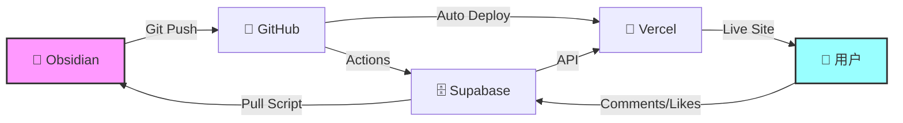

# 🔄 Aura 完美闭环工作流

## 📋 工作流概览



## 🎯 完整闭环说明

### 1. **Obsidian → GitHub** 📝➡️🐙
- 在 Obsidian 中编写 Markdown 文章和笔记
- 使用 Git 版本控制，推送到 GitHub
- 支持 frontmatter 元数据管理

### 2. **GitHub → Supabase** 🐙➡️🗄️
- GitHub Actions 自动检测文件变化
- 智能解析 Markdown 并同步到数据库
- 支持冲突检测和时间戳比较

### 3. **GitHub → Vercel** 🐙➡️🚀
- 自动触发部署
- 构建优化和静态资源缓存
- 环境变量安全管理

### 4. **Supabase → 网站** 🗄️➡️🌐
- 实时数据获取和展示
- 用户交互功能（点赞、评论）
- SWR 缓存优化性能

### 5. **用户 → Supabase** 👥➡️🗄️
- 用户在网站上点赞和评论
- 实时数据存储到数据库
- 互动数据持久化

### 6. **Supabase → Obsidian** 🗄️➡️📝
- 定期拉取用户互动数据
- 同步新评论和反馈到本地
- 完成闭环，实现双向同步

## 🛠️ 核心脚本

### 📤 推送同步 (Obsidian → Supabase)
```bash
npm run sync:push    # 智能推送本地更改
```

### 📥 拉取同步 (Supabase → Obsidian)
```bash
npm run sync:pull    # 拉取远程更新和用户互动
```

### 🏥 系统健康检查
```bash
npm run health       # 检查所有组件状态
```

### 🧹 系统清理
```bash
npm run cleanup      # 清理重复文件和过期备份
```

### 🔄 完整工作流
```bash
npm run workflow:full    # 清理 + 健康检查 + 同步
```

## 📊 监控和维护

### 自动化监控
- **GitHub Actions**: 自动检测变化并同步
- **健康检查**: 定期检查各组件状态
- **备份系统**: 自动创建和管理备份

### 冲突处理
- **时间戳比较**: 自动选择最新版本
- **冲突文件**: 生成 `.conflict.md` 文件供手动处理
- **智能合并**: 保留重要更改

### 错误恢复
- **自动备份**: 每次同步前创建备份
- **回滚机制**: 出错时可恢复到之前状态
- **容错设计**: 单点故障不影响整体流程

## 🚀 快速开始

### 1. 初始化设置
```bash
# 安装依赖
npm install

# 配置环境变量
cp .env.example .env
# 编辑 .env 文件，填入 Supabase 配置

# 运行健康检查
npm run health
```

### 2. 日常使用
```bash
# 在 Obsidian 中编写内容
# 提交到 Git
git add .
git commit -m "新增文章: 标题"
git push

# GitHub Actions 会自动同步到 Supabase
# Vercel 会自动部署最新版本
```

### 3. 定期维护
```bash
# 每周运行一次完整工作流
npm run workflow:full

# 拉取用户互动数据
npm run sync:pull

# 检查系统健康状态
npm run health
```

## 🔧 高级配置

### GitHub Actions 触发条件
- **自动触发**: 推送到 main 分支
- **手动触发**: 支持选择同步模式
- **定时触发**: 可配置定期同步

### 同步策略
- **智能检测**: 只同步有变化的文件
- **批量处理**: 高效处理大量文件
- **增量同步**: 避免重复传输

### 备份策略
- **自动备份**: 每次同步前备份
- **保留策略**: 保留最近 5 个备份
- **过期清理**: 自动删除 30 天前的备份

## 📈 性能优化

### 缓存策略
- **SWR 缓存**: 前端数据缓存
- **Vercel 缓存**: 静态资源缓存
- **数据库索引**: 优化查询性能

### 构建优化
- **代码分割**: 按需加载组件
- **资源压缩**: 最小化文件大小
- **CDN 加速**: 全球内容分发

## 🛡️ 安全措施

### 数据安全
- **环境变量**: 敏感信息加密存储
- **API 密钥**: 最小权限原则
- **数据备份**: 多重备份保护

### 访问控制
- **RLS 策略**: 数据库行级安全
- **CORS 配置**: 跨域请求控制
- **速率限制**: 防止滥用

## 🎉 工作流优势

### ✅ **完全自动化**
- 从写作到发布全程自动化
- 无需手动干预，专注内容创作

### ✅ **双向同步**
- 本地和云端数据实时同步
- 用户互动数据回流到本地

### ✅ **容错性强**
- 多重备份和恢复机制
- 单点故障不影响整体流程

### ✅ **高性能**
- 智能缓存和优化策略
- 全球 CDN 加速访问

### ✅ **易维护**
- 完善的监控和诊断工具
- 自动化清理和优化

## 📞 故障排除

### 常见问题
1. **同步失败**: 检查网络连接和 API 密钥
2. **冲突文件**: 手动合并后重新同步
3. **部署失败**: 检查构建日志和环境变量

### 诊断工具
```bash
npm run health      # 系统健康检查
npm run test:supabase  # 数据库连接测试
npm run cleanup     # 清理系统文件
```

### 获取帮助
- 查看 GitHub Actions 日志
- 检查 Vercel 部署状态
- 运行健康检查脚本

---

🎯 **这就是 Aura 的完美闭环工作流！从 Obsidian 的第一个字符，到用户的最后一次点赞，每个环节都无缝连接，构成了一个高效、稳定、可扩展的现代化内容管理系统。**